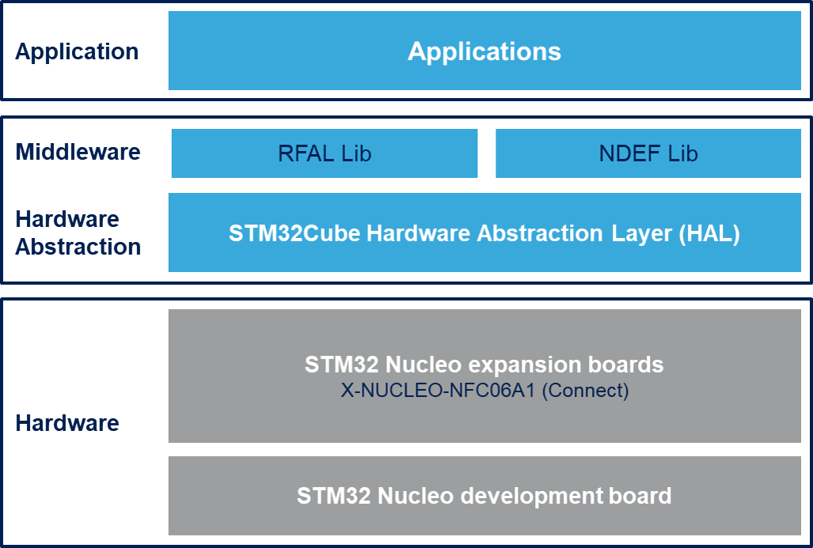

::: {.row}
::: {.col-sm-12 .col-lg-4}

::: {.card .fluid}

::: {.sectione .dark}

# <small>Release Notes for</small> **X-CUBE-NFC6**
Copyright &copy; 2020 STMicroelectronics\
    
{.logo}

:::
:::

# License

This software package is
licensed by ST under SLA0094, the "License"; You may not use this component except in compliance
with the License. You may obtain a copy of the License at:

[SLA0094: SOFTWARE LICENSE AGREEMENT](http://www.st.com/SLA0094)

# Purpose

The X-CUBE-NFC6 software package is an expansion for STM32Cube. This software provides drivers running on STM32 for ST25R3916 device. It is built on top of STM32Cube software technology that ease portability across different STM32 micro-controllers. This Expansion Firmware is built over the X-NUCLEO-NFC06A1 Expansion Board. This Expansion Board can be plugged on the Arduino UNO R3 connectors of any STM32 Nucleo board. The user can mount the ST Morpho connectors if required. The Expansion Board can be easily stacked in order to evaluate different devices with NFC communication.

**X-CUBE-NFC6 software features**:

- Complete middleware to build applications using the ST25R3916 high performance HF reader / NFC front end IC

- Easy portability across different MCU families thanks to STM32Cube

- Free user-friendly license terms

- Examples implementation available on board X-NUCLEO-NFC06A1 plugged on top of one NUCLEO board

- The technologies currently supported by RFAL are:
	NFC-A \ ISO14443A (T1T, T2T, T4TA)
	NFC-B \ ISO14443B (T4TB)
	NFC-F \ FeliCa (T3T)
	NFC-V \ ISO15693 (T5T)
	ST25TB (ISO14443-2 Type B with proprietary protocol)
	Card Emulation Type A and F

[]

Here is the list of references to user documents:

- [X-NUCLEO-NFC06A1 SCHEMATIC](https://www.st.com/content/ccc/resource/technical/layouts_and_diagrams/schematic_pack/group0/14/a3/7b/f3/34/1b/4d/17/X-NUCLEO-NFC04A1%20schematics/files/x-nucleo-nfc04a1_schematic.pdf/jcr:content/translations/en.x-nucleo-nfc04a1_schematic.pdf)
- [High performance NFC universal device and EMVCo reader](https://www.st.com/resource/en/datasheet/st25r3916.pdf)
- [UM2616 Getting started with the X-CUBE-NFC6 near field communication transceiver software expansion for STM32Cube](https://www.st.com/resource/en/user_manual/dm00635198-getting-started-with-the-xcubenfc6-high-performance-hf-readernfc-initiator-ic-software-expansion-for-stm32cube-stmicroelectronics.pdf)

:::

::: {.col-sm-12 .col-lg-8}
# Update History
::: {.collapse}
<input type="checkbox" id="collapse-section4" checked aria-hidden="true">
<label for="collapse-section4" aria-hidden="true">__1.1.0 / October 19th 2020__</label>

			

## Main Changes

  Headline
  ----------------------------------------------------------
  RFAL updated to v2.2.0
  NDEF support
  Introduced Low-Power mode and drivers update 
  
  

  : Additional features

## Contents

  Name                                                        Version                                           License                                                                                                       Release note
  ---------------------------------------------------------- ------------------------------------------------- ------------------------------------------------------------------------------------------------------------- ------------------------------------------------------------------------------------------------------------------------------------------------
  **NFC06A1**                                                 	V1.0.0                                            [BSD-3-Clause](http://opensource.org/licenses/BSD-3-Clause)                                                                          [release note](Drivers\BSP\NFC06A1\Release_Notes.html)
  **ST25R3916**                                                 V1.0.2                                            [BSD-3-Clause](http://opensource.org/licenses/BSD-3-Clause)                                                                          [release note](Drivers\BSP\Components\ST25R3916\Release_Notes.html)
  **RFAL**                                                  	V2.2.0                                            [BSD-3-Clause](http://opensource.org/licenses/BSD-3-Clause)                                                                          [release note](Middlewares\ST\rfal\doc\Release_Notes.html)
  : Components

\

Note: in the table above, components **highlighted** have changed since previous release.

## Known Limitations

  Headline
  ----------------------------------------------------------
   Not Any

\

## Development Toolchains and Compilers

- IAR System Workbench v8.50.5
- ARM Keil v5.31
- STM32CubeIDE v1.4.2

## Supported Devices and Boards

- NUCLEO-L476RG MB1136 rev.C
- NUCLEO-L053R8 MB1136 rev.C
- X-NUCLEO-NFC06A1

## Backward Compatibility

N/A

## Dependencies

This software release is compatible with:

- STM32CubeHAL L0 V1.11.2
- STM32CubeHAL L4 V1.14.0

:::

::: {.collapse}
<input type="checkbox" id="collapse-section4" checked aria-hidden="true">
<label for="collapse-section4" aria-hidden="true">__1.0.0 / July 15th 2019__</label>

			

## Main Changes

  Headline
  ----------------------------------------------------------
  First official release of firmware for X-NUCLEO-NFC06A1 Expansion Board
  

  : Additional features

## Contents

  Name                                                        Version                                           License                                                                                                       Release note
  ---------------------------------------------------------- ------------------------------------------------- ------------------------------------------------------------------------------------------------------------- ------------------------------------------------------------------------------------------------------------------------------------------------
  **NFC06A1**                                                 	V1.0.0                                            [SLA0044](http://www.st.com/SLA0044)                                                                          [release note](Drivers\BSP\NFC04A1\Release_Notes.html)
  **ST25R3916**                                                 V1.0.2                                            [SLA0044](http://www.st.com/SLA0044)                                                                          [release note](Drivers\BSP\Components\ST25DV\Release_Notes.html)
  **RFAL**                                                  	V2.0.10                                            [SLA0044](http://www.st.com/SLA0044)                                                                          [release note](Middlewares\ST\rfal\doc\Release_Notes.html)
  : Components

\

Note: in the table above, components **highlighted** have changed since previous release.

## Known Limitations

  Headline
  ----------------------------------------------------------
   Not Any

\

## Development Toolchains and Compilers

- IAR System Workbench v8.40
- ARM Keil v5.27
- STM32CubeIDE v1.2.0

## Supported Devices and Boards

- NUCLEO-L476RG MB1136 rev.C
- NUCLEO-L053R8 MB1136 rev.C
- X-NUCLEO-NFC06A1

## Backward Compatibility

N/A

## Dependencies

This software release is compatible with:

- STM32CubeHAL L0 V1.11.2
- STM32CubeHAL L4 V1.14.0

\

  
:::

:::
:::

<footer class="sticky">
For complete documentation on **X-CUBE-NFC6** ,
visit: [[X-CUBE-NFC6](https://www.st.com/en/embedded-software/x-cube-nfc6.html)]

This release note uses up to date web standards and, for this reason, should not
be opened with Internet Explorer but preferably with popular browsers such as
Google Chrome, Mozilla Firefox, Opera or Microsoft Edge.
</footer>
